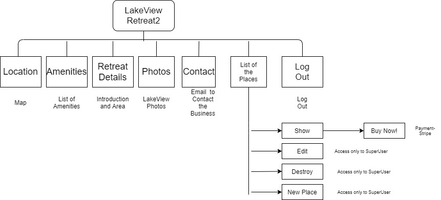
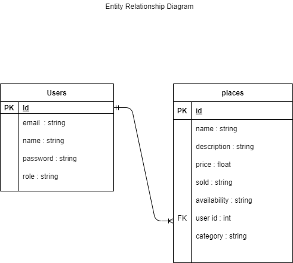
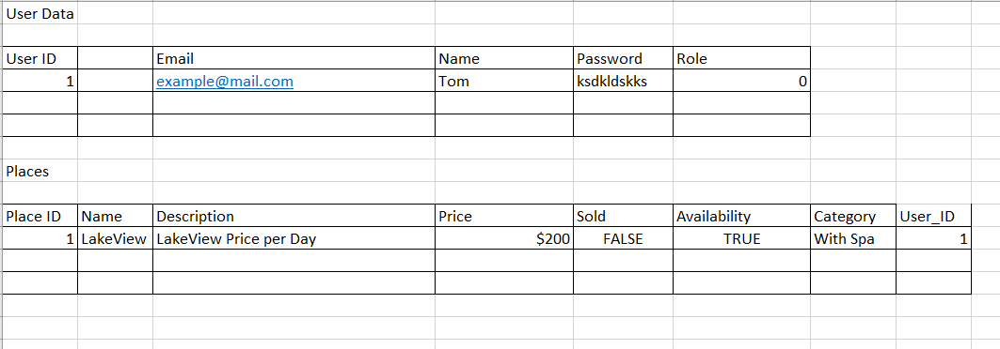

# T2A2 Marketplace App

## Identification of the problem you are trying to solve by building this particular marketplace app.

This is an app for short term holiday. The app is focused on renting an apartment/ freestanding house of my family. It is for short stay/holiday stay, I have one property that I like to include in this app, also it has possibility to include more properties. Potential guests should be able to send an email for booking, send a booking request, book the place and make a payment. The problems this app solves is rental accommodation and being able to rent a place without a second party service. By making rental accommodation not on sites such Airbnb, Booking.com and Stayz.com we eliminate a third party service and open renters to a new experience of rental accommodation direct from the owners for a competitive price.

## Why is it a problem that needs solving?
Client needs a personalized app to market her product that is short stay holiday accommodation. Requirement is to supply the product direct to the customer without third party involvement. This could result in a reduction in cost of accommodation through eliminating service fee and increasing bookings for the client.

## Deployed app
[LakeView Retreat(Heroku)](https://lakeviewretreat2.herokuapp.com/)
## GitHub Link
[LakeView Retreat(Github)](https://github.com/Devbreaker29/LakeViewRetreat2)
## Description of your marketplace app (website), including:
- Purpose
To advertise accommodation without a third party and increase marketing and bookings of the property.
- Functionality / features
Devise for User Authentication.
Stripe for payment.
Cloudinary for picture storage.
CanCanCan for setting admin access.
- Sitemap

- Screenshots
See Word document Screenshots LakeView
- Target audience
Holiday Makers (couples) Future Business Customers (Owners of the Property)
- Tech stack (e.g. html, css, deployment platform, etc)
Ruby On Rails
PostgresSQL
Github
Devise
Stripe
Cloudinary
CanCanCan
Heroku
HTML
CSS
BootStrap
## User stories for your app
Sign Up to the app, and create a User.ID with email address and password. Then login to the site and browse listings by clicking on the Nav Bar. You can click the number of items in the Nav Bar such as listing details, photos and location. You can click on the contact page and get in touch with the owner for bookings. When booking dates are emailed back to the owner a listing is created with User.ID. Then User can login and click the Buy Now button under Places tab and make a payment to confirm/pre-book the booking.
## Wireframes for your app
Balsimiq Wireframes file HashiePussegoda_T2A2
## An ERD for your App

## Explain the different high-level components (abstractions) in your app
I have used CanCanCan Ruby Gem for authentication of my app. CanCan gem is authorization library for rails, it restricts certain resources that Users allowed to access. I have set up a Super_User who is the only person that has access to edit, destroy and create Listings (Bookings/Places). CanCan sets up an ability class in model and you can set it up to deny access. User Permissions are defined in Ability.rb file and they are not set up anywhere else such as controllers, Views and database queries.

Stripe - I have included Stripe payment system in my app. It is a payment processing platform. User can access Places (Bookings) and use the Buy Now button which allows them to transfer money from User's Bank Account to Owner's Bank Account by way credit and debit card transaction. The process was established by installing a Stripe gem and using an API in Rails Credentials.

Cloudinary - I have also set up Cloudinary for picture storage. This reduces the network strain on server from large picture files on local storage. The images are set up on Cloudinary, by having it outside our deployment, reduces network strain. Cloudinary gems for image upload are cloudinary and active storage -cloudinary-service. Cloudinary is managed by an API which is inserted in the Rails Credentials. By using Cloudinary you store your image that you upload on the Cloud storage.

## Detail any third party services that your app will use.
Cloudinary for picture storage. It is a free cloud based storage that many developers use to create and manage digital images. API used to stored your images on Cloud Storage. I have also set up Cloudinary for picture storage. This reduces the network strain on server from large picture files on local storage. The images are set up on Cloudinary, by having it outside our deployment, reduces network strain. Cloudinary gems for image upload are cloudinary and active storage -cloudinary-service. Cloudinary is managed by an API which is inserted in the Rails Credentials. By using Cloudinary you store your image that you upload on the Cloud storage.

Stripe for payment services. It is an online payment structure for businesses. I have set up the payments system with API for users to pay for bookings.

I have included Stripe payment system in my app. It is a payment processing platform. User can access Places (Bookings) and use the Buy Now button which allows them to transfer money from User's Bank Account to Owner's Bank Account by way credit and debit card transaction. The process was established by installing a Stripe gem and using an API in Rails Credentials.

## Describe your projects models in terms of the relationships (active record associations) they have with each other

There are three models in my app, ability, place and user. ActiveRecord Association is a convineint way to create an association between database columns. We can write methods that use some of the logic of ActiveRecord behind the scene to access what information you want to access in columns and tables. When the user model is created, the User class inherits from ApplicationRecord and when you check Application_record.rb and it inherits from ActiveRecord. Through creating User Model there are alot of functionality added to access database using logic of ActiveRecord. The other model I have is Place Model. The place.rb file has a Place Class that inherits from ApplicationRecord and that inherits from ActiveRecord. When creating models, I have created a user_id as the foreign key in Users Model and Places Model. Hence 'User' has many 'Place' belongs to one user, therefore the relationship between User Model and Place Model established. When a User is created, one User can have more than one booking (place). One booking (Place) can have only one user.

Ability model was created when running the CanCanCan Gem for User Authentication command.

## Discuss the database relations to be implemented in your application.

As in my entity relationship diagram explains, Users entity has UserId as the foreign key and it also has columns for email, name, password, role. Places entity has UserId as the foreign key and columns for name (place), description, price, sold, availability and category. When a User is created with Relationship with Place (Booking) is created through the foreign key. Then the User can access Places(Booking) and choose to buy.

## Provide your database schema design.

## Describe the way tasks are allocated and tracked in your project.

I planned my project by consulting the user and identifying the user's problem, their needs, requirements and planning how to solve the business problem. Then I drew my initial ERB. Then drew initial wireframes. The next stage was to deciding on what third parties services are necessary to solve the business problem. Then I drew up a sitemap of my website in order to understand how the pages are structured in the website and the links between pages, and what should be in each page. Once my preliminary planning is done I allocated the tasks in the calender, based on my plan and assignment rubric. I planned accordingly to make sure time allocations included review and feedback.

I revisted my plan each day to make sure I am on track and seek help/extra resources when needed. I also reviewed my previous work to make sure the project is progressing as planned.

Drawbacks- I tried to install ActionMailer to send email messages to Users but after spending too many hours I had to give it up.